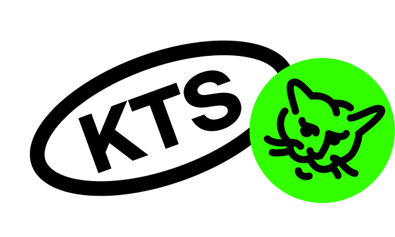

# @kts-specials/mediaproject-styled-components

Пакет с общими миксинами и анимациями на styled-components для медиапроектов.

## Использование

`npm install @kts-specials/mediaproject-styled-components`

`yarn add @kts-specials/mediaproject-styled-components`

## Содержимое

### Миксины и анимации

* [mixins.ts](./src/mixins.ts) — миксины
* [animations.ts](./src/animations.ts) — анимации

Чтобы использовать миксин или анимацию в проекте с styled-components, импортируйте нужный объект из библиотеки:

```typescript
import { mixins } from '@kts-specials/mediaproject-styled-components';

...

${mixins.centerPos()};
```

## Обратная связь

Любой фидбэк вы можете передать нам на почту [hello@ktsstudio.ru](mailto:hello@ktsstudio.ru) в письме с темой "mediaproject-styled-components"
